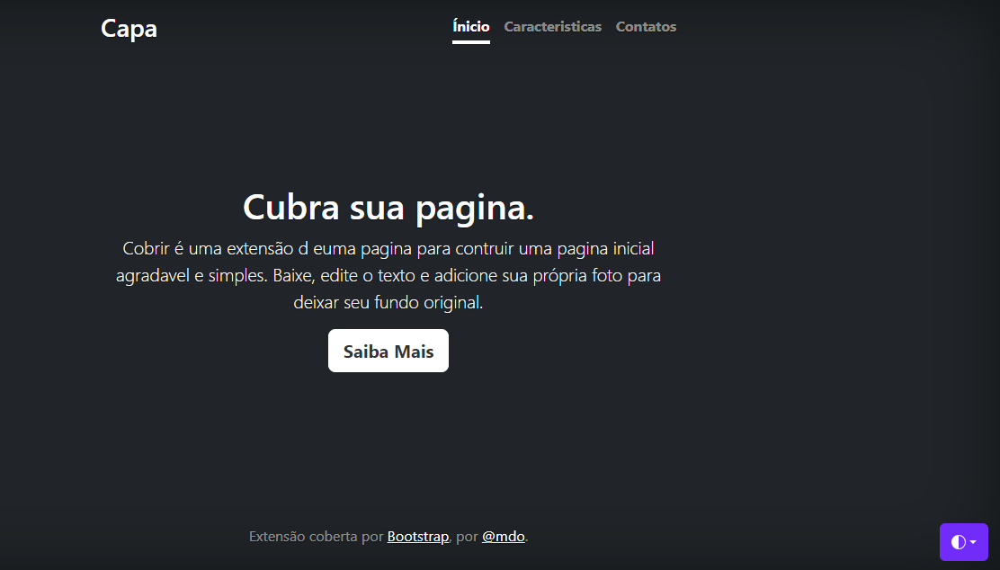

# Índice

[Projeto - Portfólio para escrita do README](#projeto---portf%C3%B3lio-para-escrita-do-readme)  
[Descrição](#descri%C3%A7%C3%A3o)  
[Funcionalidade](#funcionalidade)  
[Tecnologias utilizadas](#tecnologias-utilizadas)  
[Fontes consultoras](#fontes-consultadas)  
[Autores](#autores)  

# 💕Projeto - Portfólio para escrita do README

## ❤️Descrição
Isso é um projeto que assim, foi criado para me ajudar a aprender com a comentação de códigos. Os jeito mais organizados e entendivelmente possivel a todos que estejam lendo esse arquivo README.
## 😘Funcionalidade
O código está servindo como uma demonstração de um estilo e edição de bootstrap.
### 💖Tecnologias utilizadas
 

#### VSCODE
Version: 1.80.2 (system setup)  
Commit: 2ccd690cbff1569e4a83d7c43d45101f817401dc  
Date: 2023-07-27T20:40:28.909Z  
Electron: 22.3.14  
ElectronBuildId: 22695494  
Chromium: 108.0.5359.215  
Node.js: 16.17.1  
V8: 10.8.168.25-electron.0  
OS: Windows_NT x64 10.0.22000  
## 🥰Fontes consultadas
Bootstrap
- exemplo de readme por github
https://gist.github.com/lohhans/f8da0b147550df3f96914d3797e9fb89
- exemplo de readme na alura
https://www.alura.com.br/artigos/escrever-bom-readme
## 😍Autores
- Marsh